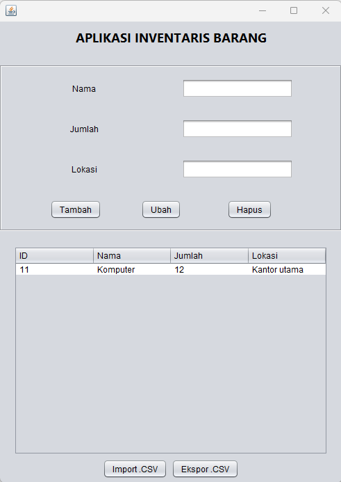

# AplikasiInventarisBarang
 UTS - Noor Admayanti - 2210010295

Aplikasi Inventaris Barang adalah sebuah aplikasi berbasis Java Swing yang digunakan untuk mengelola data inventaris barang. Aplikasi ini menyediakan fitur untuk menambahkan, mengubah, menghapus, menampilkan data, serta mengekspor dan mengimpor data dalam format CSV.

## Fitur
- **Tambah Data**: Menambahkan data barang baru ke dalam database.
- **Tampilkan Data**: Menampilkan semua data barang dalam tabel.
- **Ubah Data**: Mengubah informasi barang berdasarkan ID.
- **Hapus Data**: Menghapus barang berdasarkan ID.
- **Ekspor CSV**: Mengekspor data inventaris ke file CSV.
- **Impor CSV**: Mengimpor data dari file CSV ke database.

## Teknologi yang Digunakan
- **Java**: Bahasa pemrograman utama.
- **Java Swing**: Untuk antarmuka pengguna (GUI).
- **JDBC**: Untuk koneksi ke database.
- **SQLite**: Sebagai database bawaan.
- **Maven** (opsional): Untuk manajemen dependensi.

## Cara Menggunakan
### 1. Menjalankan Aplikasi
1. Clone repository ini:
   ```bash
   git clone https://github.com/username/repo-inventaris-barang.git
2. Tambahkan driver SQLite ke library proyek.
3. Jalankan file `AplikasiInventarisBarang.java` untuk memulai aplikasi.

### 2. Database
- Aplikasi menggunakan **SQLite** sebagai database bawaan.
- File database akan dibuat secara otomatis saat aplikasi dijalankan, asalkan konfigurasi pada `DatabaseConnection` sudah benar.

### 3. Ekspor dan Impor CSV
#### Ekspor CSV
- Klik tombol **Ekspor** untuk menyimpan data inventaris ke file `data_inventaris.csv`.

#### Impor CSV
- Pastikan file `data_inventaris.csv` ada di direktori aplikasi.
- Klik tombol **Impor** untuk membaca data dari file tersebut.

## Struktur Kode
- **Main Application**: `AplikasiInventarisBarang.java`
- **Fungsi CRUD**:
  - `tambahData`
  - `tampilkanData`
  - `ubahData`
  - `hapusData`
- **Ekspor/Impor**:
  - `eksporDataKeCSV`
  - `imporDataDariCSV`
- **Database Connection**: Koneksi ke SQLite menggunakan `DatabaseConnection`.

## Screenshots

